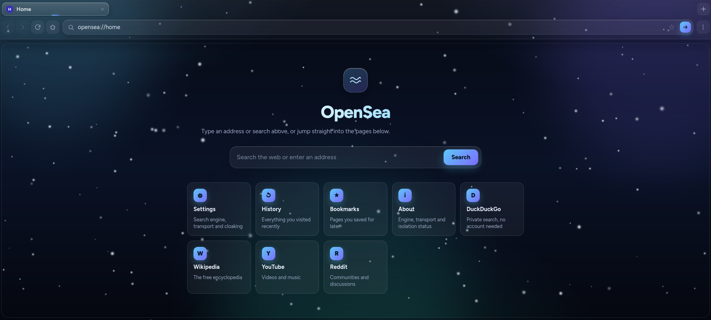

<h1 align="center">OpenSea</h1>

  OpenSea is a proxy that is built on Scramjet with fallback transports like libcurl, epoxy, wisp and bare with custom protocols.

## Roadmap

* Multiple Tabs
* URL Scheming
* Settings
* Open any URL

## LICENSE

This project is protected by the [GNU Affero General Public License](LICENSE)
